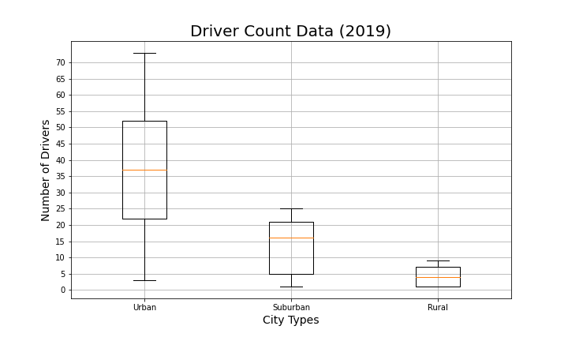

# PyBer Analysis
# Analysis on Ride-Sharing data between Urban/Suburban/Rural Cities 
## Analysis Overview 

PyBer is a ride sharing app similar to the likes of UBER. We have access to PyBer's ride data for the beginning of 2019, which spans across all cities that they cover. There are three separate categories/types of cities that PyBer covers:

1. Urban 
2. Suburban 
3. Rural 

An analysis was done to help increase accessibility to the PyBer ride-sharing service, and determine affordability in certain cities based on their city's type. 

To help improve access to PyBer and determine affordability in certain neighborhoods, visualizations on total rides, total drivers, total fares, average fare per ride and driver, and total fare, and how they compare between city types

## Results
- Data Source: [city_data.csv](Resources/city_data.csv), [ride_data.csv](Resources/ride_data.csv)
- Software: Python 3.7.6, Visual Studio Code, 1.51.0

### Table 1 - Overall Summary of the PyBer Ride-Sharing Data
</img>

The summary shows that Urban cities have the highest amount of drivers and riders, while having the lowest fares. In comparison, Rural cities have very the lowest rides/drivers but have the highest average fare per ride and per driver. 

The above table can be seen as a bubble chart (see below) to help visualize where most of the rides are taking place and at what average fare.

** Note that the circle size correlates with driver count per city**

Figure 1: Ride-Sharing data visualized 
</img>

Though Rural cities can charge at a higher price, total fares are highest in Urban cities as volume of rides and drivers are much higher in these cities.

### Figure 2 - % Total Fare vs % Total Rides
|% Total Fare| %Total Rides|
|------------|-------------|
|</img>|</img>|

In comparing the percentage totals between the types of city to the total fares received and total rides, the distribution are similar. Urban Cities receiving the most fares and rides. 

Comparing this with the total drivers in each type:
### Figure 3 - % Total Drivers by City Type
</img>
This is showing that there is an overabundance of Urban city drivers. Which is shown to be the most variable of the three city types when looking at the driver data box plot:

### Figure 4 - Driver Count Data

</img>

The whisker on the Urban box plot extends much further in comparison to the other two city types, but is fairly balanced. In comparison to the Suburban box plot's median is higher on its box plot vs. the other two. Its skewness higher on the box, meaning that most of the data resides at the higher end of the box. 

Looking at another box plot but for ride count, we can see that the number of rides is the most variable.  

### Figure 5 - Ride Count Data
</img>

Looking at the fare data, Rural cities are slightly skewed in the upper portion, where the other cities are fairly symmetrical 

### Figure 6 - Ride Fare Data
</img>

Lastly, we see a slight jump across all city types just before March:

### Figure 7 - Total Fare by City Type
</img>

## Summary 
Three business recommendations to the CEO for addressing any disparities among the city types: 
1. Promote for more drivers leading up to March

    The slight increase in total Fares right before march, which may be due to warmer weather after the winter months. This is more likely due to a seasonal influence as we can see the jump happening across all city types.

2. Too many Urban drivers
    
    There are a high amount of Urban city drivers, which is to be expected as the population density of urban city centers are high. Many in urban cities like Toronto and New York, are more likely to get around using taxi's or ride-sharing services instead of driving their own car in the city. That or people living in Urban cities don't even own their own cars.

    In reference to [Table 1](#table-1---overall-summary-of-the-pyber-ride-sharing-data) - there are 2405 drivers to 1625 ride, meaning there may be too many drivers in Urban areas. If there is such high supply of drivers, drivers are more willing to lower their fares to stay competitive to get riders. Whereas the suburbs and rural areas exceed the amount of drivers available in their respective city type. But this high amount of drivers could be justified when looking at [Figure 5](#figure-5---ride-count-data), as the ride count varies quite a lot.
    
    A recommendation is to attempt to increase driver count in suburban areas, as the box and whisker plot see [(Figure 3)](#figure-3---%-total-drivers-by-city-type) for suburban cities are skewed in the higher part of the box. Meaning that the number of drivers are not evenly distributed and could benefit in having more drivers
    
3. Increase fare prices for Rural cities - or give incentive to drivers
    The summary shows that Urban cities have the highest amount of drivers and riders, while having the lowest fares. In comparison, Rural cities have very the lowest rides/drivers but have the highest fares. 

    This is most likely due to most people living in urban or suburban cities, and fares need to compensate drivers to drive to rural areas to pick up riders. 

    Since there are less people in rural areas and they also span across larger areas, there is less incentive to share rides with others as there are no one to share it with.

